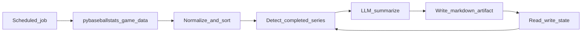

# Guardians UmpScorecards monitoring agent — initial plan

This document is the approved blueprint for implementing the agent and for saving as [`docs/initial-plan.md`](/Users/ipstenu/Development/basebelles/statistics/docs/initial-plan.md) once you exit plan mode and request the file write.

## 1. Situation analysis

**Core problem:** UmpScorecards has no *documented* public API for consumers; games must still be **obtained reliably**, grouped into series, and summarized when a series is complete.

**Primary approach — `pybaseballstats`:** Use the dedicated **[pybaseballstats](https://pypi.org/project/pybaseballstats/)** submodule `pybaseballstats.umpire_scorecards`, which wraps the JS-heavy UmpScorecards pipeline and returns **Polars** frames (`game_data(start_date=..., end_date=...)`). Convert with `.to_pandas()` and filter to Cleveland with `(df['Home'] == 'CLE') | (df['Away'] == 'CLE')`. This **replaces raw Playwright/Selenium scraping as the default** ingestion path and avoids maintaining browser automation for the happy path.

**Secondary context:** A naive `requests` fetch of the single-team URL still shows “Loading data ...”; that explains why **direct HTML scraping is brittle**. Keep **Playwright or manual network capture** only as a **contingency** if the package lags a site change or you need to debug column drift.

**Key assumptions to validate before locking logic:**

- **Row order:** The sample code uses `series_groups.iloc[0]` to pick “latest” series. That only matches intent if the table’s **first block** corresponds to the **most recent** series (e.g. newest-first). You must confirm sort order on the rendered table and branch logic: *newest-first* vs *oldest-first* determines whether “latest series” is the first or last contiguous opponent block.
- **Row population:** Confirm whether the table lists **only completed** games or also **scheduled** games. Series-end detection differs if you can see the “next” opponent in-table vs needing an external schedule.

**First-principles breakdown:**

1. **Ingest** stable row-level facts via `us.game_data(...)`: date, home, away, umpire, `Favor (Home)` (confirm exact column names in a one-off spike), and any game id column if present.
2. **Normalize** `Favor (Home)` to **CLE-centric** `CLE_Favor` (your sign rules are correct).
3. **Segment** rows into series by **runs of consecutive equal opponent** (after defining opponent as the non-CLE team).
4. **Persist state** between runs so you know what was already summarized and what constitutes a **newly completed** series.
5. **Summarize** only when your **series-completion predicate** is true, then **emit** a markdown artifact (and optionally a GitHub Issue body) for traceability.

## 2. Solution architecture

### 2.1 Data acquisition

| Approach | Role |
|----------|------|
| **`pybaseballstats.umpire_scorecards` (`game_data`)** | **Primary:** date-bounded pull; Polars → Pandas; filter to CLE. Handles JS/backend details upstream. |
| **Playwright / Selenium** | **Contingency only:** if the package breaks or lags schema changes; or for debugging parity with the website. |
| **`requests` + `read_html`** | Not recommended for production; possible for ad-hoc comparison. |

**Date windows for a daily job:** Each run should pass a **`start_date` / `end_date`** that covers **recent games plus overlap** (e.g. last 10–14 days rolling, or “since last successful run minus 1 day”) so you do not miss late corrections and can dedupe by stable keys. Avoid fetching an entire season every night unless profiling shows it is cheap.

**Installation:** `pip install pybaseballstats` (pin a version in `requirements.txt` / `pyproject.toml`).

**Robustness:** Lock **expected column names** after the spike; add a small schema check at runtime (required columns present) with a clear error if `pybaseballstats` changes output shape.

### 2.2 Core metrics (align with your blueprint)

- **Opponent:** `Away` if `Home == CLE`, else `Home`.
- **`CLE_Favor`:** `Favor (Home)` when CLE is home; **negate** when CLE is away.

No change to this math in the plan; it matches UmpScorecards’ “favor from home team’s perspective” semantics.

### 2.3 Series grouping

- Build opponent column and `CLE_Favor` as above.
- Sort rows into a **canonical chronological order** (oldest → newest) *after* ingestion if the site uses reverse order—**do not** assume `iloc[0]` without this step.
- Assign **run-length encoding** on consecutive equal `Opponent` after chronological sort: each run is one **series slice** (same opponent, road/home may alternate within the slice).

### 2.4 When a series is “done” (state machine)

Pure “opponent changed between adjacent rows” is **necessary but not sufficient** for “series ended yesterday”: the **last game of a series** is only knowable in hindsight when the **next** game is against someone else **or** you have schedule context.

**Recommended predicate (minimal, table-only):**

- Maintain persistent state, e.g. `state.json` (or small SQLite): `last_processed_game_id` (or composite key: date + home + away), `last_emitted_series_key` (e.g. `opponent_slug + end_date`), optional `pending_series_opponent`.
- On each daily run:
  1. Ingest current table; normalize and sort chronologically.
  2. Identify the **terminal row** of each opponent run (last row before opponent changes).
  3. A series **S** is **complete** when there exists a **later** row whose opponent ≠ **S**’s opponent (i.e. a newer game has started against a different team). The **last row of the previous run** is the series end.
  4. **Emit** at most one summary per completed series **once**, keyed by `(opponent, last_game_date, game_count)`—idempotent across reruns.

Optional refinement if the table includes **future** rows: treat series as complete when the **next chronological row** is a different opponent (covers off-days without needing MLB schedule).

**Avoid** relying solely on “MLB series are usually 3–4 games”—use it as a **sanity check**, not a trigger.

### 2.5 LLM summary

- **Input:** structured JSON—opponent, games (date, home/away, umpire, `CLE_Favor`), sum and per-game breakdown, total `CLE_Favor`.
- **Model:** GPT-4o or Claude via official API; temperature low; require **two sentences**, **no fabricated stats**, cite totals from input only.
- **Guardrails:** refuse/overrides if missing cells; log raw table snippet on parse failure.

### 2.6 Output (your choice: repo / CI artifact)

- **Primary:** append or write under e.g. `artifacts/umpscorecards/YYYY-MM-DD-<opponent>-series.md` (or `docs/generated/...` if you prefer visibility in-repo).
- **Optional:** open/update a **GitHub Issue** per series via `actions/github-script` or `gh issue create` with the same body—still “artifact-like,” good for notifications without social APIs.
- **CI:** scheduled workflow (e.g. daily **after** typical game end, US/Eastern), with **concurrency** group to avoid duplicate runs, and **secrets** only for LLM key.

## 3. Tech stack (concise)

- **Python 3.11+**, **`pybaseballstats`** (Polars in; **`pandas`** after `.to_pandas()` for the rest of the pipeline if desired).
- **`pandas`** for manipulation (optional: stay in Polars until the LLM boundary—pick one stack for simplicity).
- **Playwright:** optional dev-only contingency—not required for CI if `game_data` remains stable.
- **LLM:** `openai` or `anthropic` SDK; one provider in v1.
- **Automation:** **GitHub Actions** `schedule` + manual `workflow_dispatch`; document local **cron** as alternative.
- **Config:** `.env` / GitHub Secrets for API keys; no keys in repo.

## 4. Project layout (greenfield; repo currently only [README.md](README.md))

Suggested minimal tree:

- `src/umpscorecards/` — fetch via `pybaseballstats`, normalize, series logic, LLM prompt
- `tests/` — saved **DataFrame snapshots** (CSV/Parquet) or minimal recorded `game_data` outputs; unit tests for grouping and sign logic (no need for HTML fixtures if the package is the source of truth)
- `state/` — gitignored `state.json` locally; in CI use **artifact** or **dedicated branch** / external gist—**important:** ephemeral runners lose disk unless you persist state (see risks).

## 5. Implementation notes vs your sample code

- **`read_html`:** not part of the primary path; use **package output or saved CSV fixtures** for tests.
- **`latest_series = df[series_groups == series_groups.iloc[0]]`:** replace with explicit **chronological sort** + “last completed series whose end is followed by a different opponent,” plus **deduplication** via persisted state.
- **`raw_data` `to_dict()`:** fix serialization (e.g. `orient="records"`) when implementing.

## 6. Manual validation (your next step 1)

Run a short **`game_data`** window that includes a known series (e.g. vs Royals): confirm **column names**, **`Favor (Home)`** values, **chronological order** after sort, and reconcile sum of per-game `CLE_Favor` with intuition. Optionally cross-check the website for one game if you need confidence in the package’s parity.

## 7. Risks and mitigations

| Risk | Mitigation |
|------|------------|
| **`pybaseballstats` output / upstream site drift** | Pin package version; runtime schema checks; golden DataFrame fixtures; fall back to contingency scrape only if needed |
| Site structure / JS changes (if bypassing package) | Same as above for any custom scraper path |
| **State on GitHub Actions** | Commit `state.json` via bot PR, or use **workflow artifact** + external storage, or **GitHub Issue** as ledger |
| Rate limiting / blocking | Daily schedule, modest date windows, respect upstream constraints; package may batch requests—follow its behavior |
| Legal/ToS | Low frequency, personal/blog use; follow package and site terms |

## 8. Success metrics

- Correct `CLE_Favor` on known rows (golden tests).
- No duplicate summaries for the same series across reruns.
- One markdown artifact per completed series when opponent changes in schedule/table.

## 9. Execution order (after this plan is saved to `docs/initial-plan.md`)

1. Spike: `pip install pybaseballstats`; call `us.game_data(start_date, end_date)`, `.to_pandas()`, filter CLE; print schema and sample rows; decide **rolling date window** for production.
2. Lock column schema + sort direction; add **CSV/Parquet** fixtures from real output.
3. Implement normalize + series segmentation + completion predicate + state file.
4. Wire LLM + markdown writer.
5. Add GitHub Action + document local run and state persistence strategy (no Playwright install in CI unless contingency is automated).
